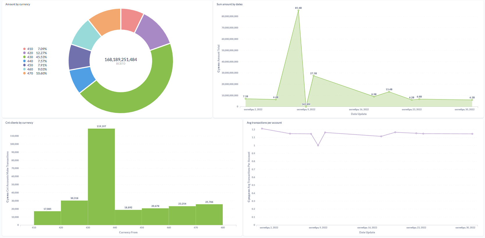

### Задача

Cобрать данные по транзакционной активности пользователей и настроить обновление таблицы с курсом валют.

### Описание

Реализовать пайплайн обработки данных из источника в Vertica, далее построить дашборды в Metabase.

### Исопользуемые технологии

- `Airflow`
- `Vertica`
- `PostgreSQL`
- `Metabase`

### Структура репозитория

- `/src/dags` - DAG's для Airflow.
- `/src/sql` - SQL-запрос формирования таблиц в `STAGING`- и `DWH`-слоях, а также скрипт подготовки данных для итоговой витрины.
- `/src/img` - скриншот реализованного над витриной дашборда.

### Дашборд

