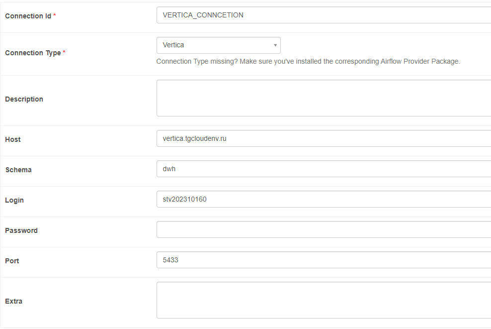

# Подключения

### Подключение PostgreSql

Airflow


```
Connection Id: PG_WAREHOUSE_CONNECTION
Host: rc1b-w5d285tmxa8jimyn.mdb.yandexcloud.net
Schema: db1
Login: student
password: password
Port: 6432
```

Для локального тестирования

```Python
import psycopg2

psql_connection = psycopg2.connect(
    dbname='db1',
    user='student',
    password='password',
    host='rc1b-w5d285tmxa8jimyn.mdb.yandexcloud.net',
    port=6432
    )
```

### Подключение Vertica



```
Connection Id: VERTICA_CONNCETION
Host: vertica.tgcloudenv.ru
Schema: dwh
Login: stv202310160
password: password
Port: 5433
```

Для локального тестирования

```Python
from vertica_python import connect

conn_info = {
    'host': 'vertica.tgcloudenv.ru',
    'port': '5433',
    'user': 'stv202310160',
    'password': 'password',
    'database': 'dwh',
    'autocommit': True
    }

vertica_conn = vertica_python.connect(**conn_info)
```
