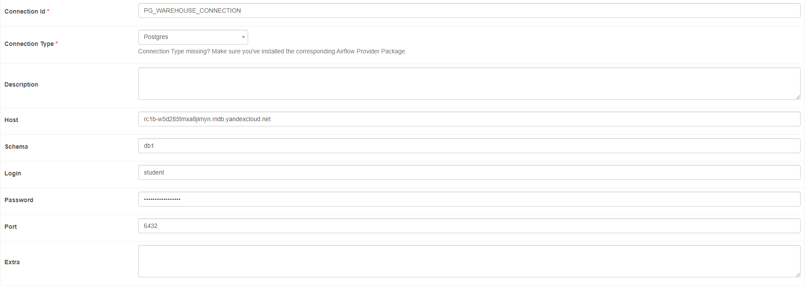

# Подключения

### Подключение PostgreSql

Airflow



```
Connection Id: PG_WAREHOUSE_CONNECTION
Host: rc1b-w5d285tmxa8jimyn.mdb.yandexcloud.net
Schema: db1
Login: student
password:
Port: 6432
```

Для локального тестирования

```Python
import psycopg2

psql_connection = psycopg2.connect(
    dbname='db1',
    user='student',
    password='password',
    host='rc1b-w5d285tmxa8jimyn.mdb.yandexcloud.net',
    port=6432
    )
```

### Подключение Vertica
